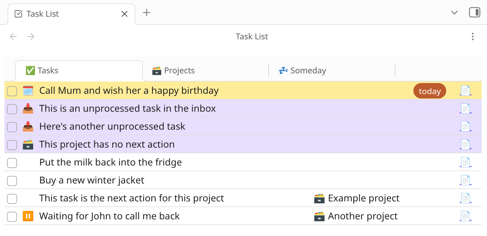
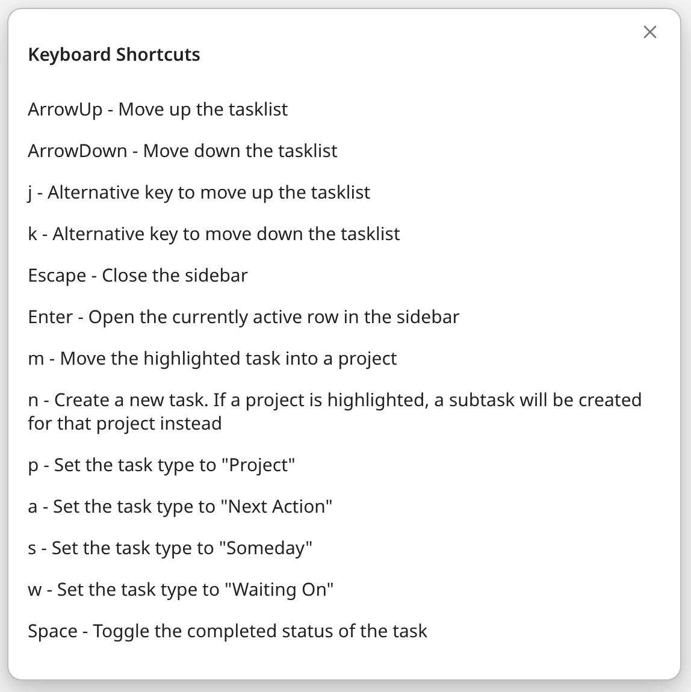

# Task Zero plugin for Obsidian

Task Zero is an opinionated GTD-style task management system for Obsidian. If you've ever used [MyLifeOrganized](https://www.mylifeorganized.net/), the UI will be immediately familiar. I love MLO and used it for many years, and wanted a similar experience inside Obsidian.

The goals of this project are:

1. Everything can be managed from the one main task page.
2. Every action be done with keyboard shortcuts.

## How to install

1. Install the **BRAT** plugin from the Community Plugins.
2. Open the Settings page for BRAT.
3. Click "Add Beta Plugin".
4. Paste in this address: `https://github.com/alangrainger/obsidian-task-zero`
5. Click "Add Plugin".

## The main task list

This is where you live. Everything can be controlled via keyboard shortcuts.

### Icons

- 📥 "Inbox" tasks which you haven't yet processed
- 🗓️ This task is now due
- 🗃️ This is a project
- ⏸️ Waiting on someone else to take an action before you can proceed
- 💤 A "someday" task

### Keyboard shortcuts

Press `?` at any time to see the keyboard shortcuts:

## Exclude tasks

You can add tags in certain places on the page to exclude tasks from being picked up by Task Zero.

###  Exclude all tasks

If you add the tag  `#exclude-all-tasks`  anywhere in the note or in the frontmatter, all tasks on this note will be ignored.

### Exclude a section

If you add the tag `#exclude-tasks` anywhere in a section, all tasks from the prior heading to the next heading will be ignored.

### Exclude an individual task

If you add the tag `#exclude` to a task, that single task will be ignored.
